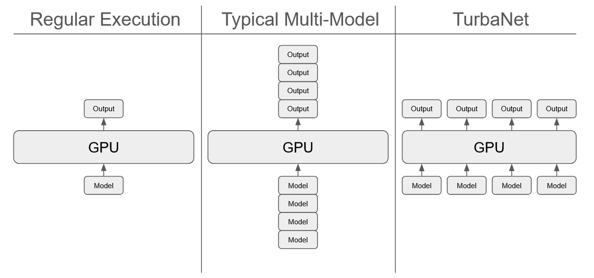
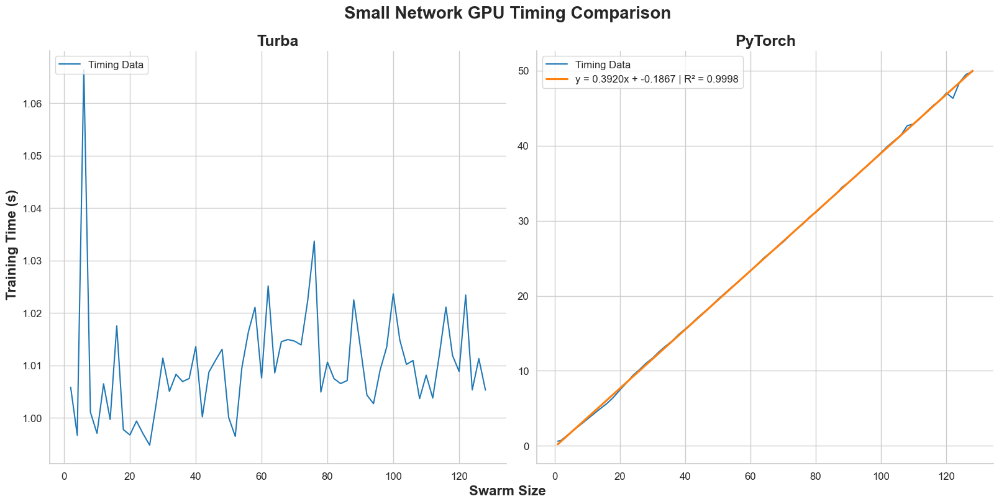
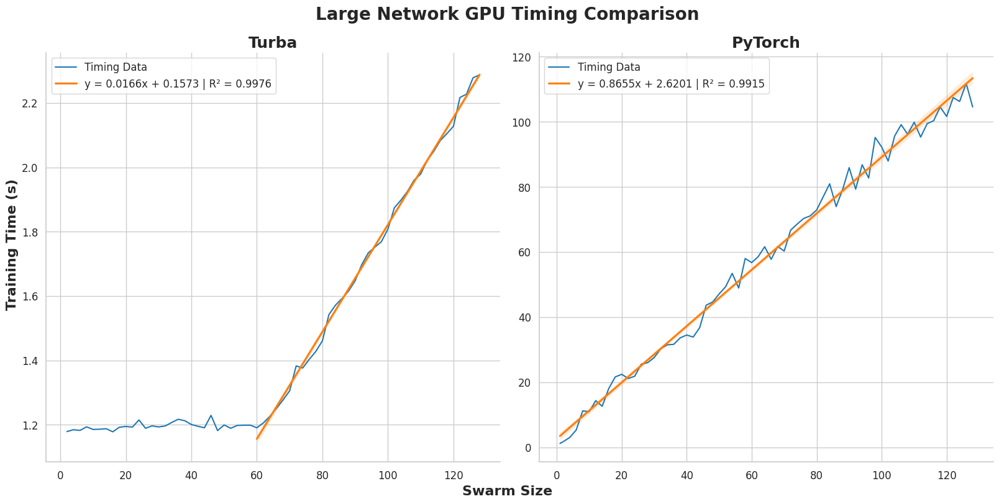
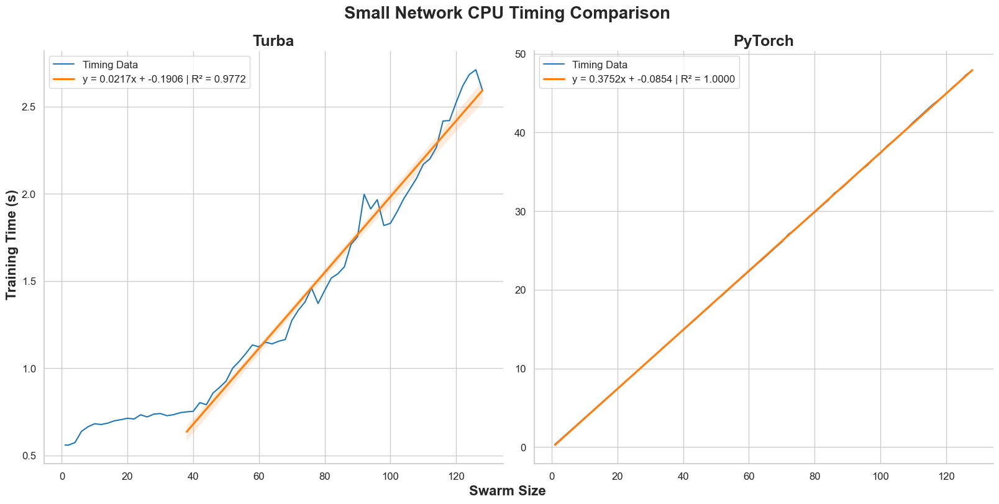
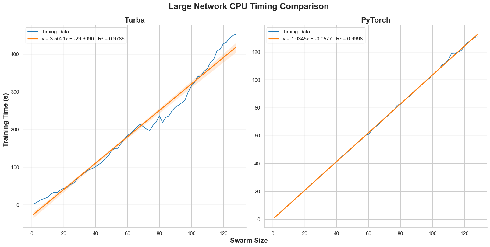
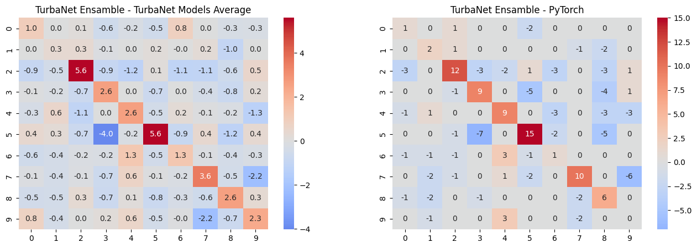

# USD MSAAI-590 Capstone Project
The purpose of this project is to demonstrate the capability and features of the [TurbaNet](https://github.com/EthanSchmitt7/TurbaNet) library developed for my capstone project in pursuit of the MSAAI program at USD.

## TurbaNet
TurbaNet is a neural network training library designed to optimize the simultaneous training of multiple small-scale models. Unlike traditional deep learning frameworks like PyTorch, which typically optimize for large, single-model training, TurbaNet leverages parallel computation to significantly improve efficiency when training multiple networks at once.

This approach is particularly beneficial in ensemble learning, where multiple models are trained on different subsets of data to improve generalization and robustness. By training all models concurrently, TurbaNet reduces the overhead of sequential training, leading to substantial speedups while maintaining model diversity. This is especially useful in scenarios where individual models are too small to fully utilize modern GPUs, making batch-style parallelism more efficient than standard single-network training.

The diagram helps to illustrates of how small network sizes can be inefficient on modern GPU architectures. Large models take advantage of the mass compute capabilities but small networks are not able to leverage it nearly as effectively. JAX and TurbaNet can solve this by vectorizing the computations from multiple models. The first diagram demonstrates a single small network which does not require enough of the bandwidth available and so it loses out on that performance. Next is what is would look like if one naively attempted to use multiple models to utilize the available bandwidth. The networks end up being run in serial and no performance gain is realized. Finally, with JAX and TurbaNet we can see how it allows the multiple networks to be evaluated concurrently and are able to use the full width of the GPUs compute capabilities.

Furthermore, TurbaNet excels in cases where multiple independent models need to learn from different data distributions, such as in federated learning, bootstrapped ensembles, or multi-agent reinforcement learning. By structuring training in a way that maximizes hardware utilization and minimizes redundant computations, TurbaNet ensures faster convergence without sacrificing the advantages of ensemble diversity.

## JAX GPU Limitations
The [JAX](https://github.com/jax-ml/jax) library which TurbaNet is built on, does not support GPUs in any environment and certain configurations will enable GPU support. For reference, see [this page](https://docs.jax.dev/en/latest/installation.html) of their documentation to see if your setup will support GPU computations. As shown in the results below, TurbaNet performs best when taking advantage of GPU computing, CPUs are not able to take advantage of vectorization as well.

# Parametric Analysis
To first demonstrate the TurbaNet library was performing as expected, a parametric study was conducted which aimed to investigate the effect on runtime as the size of the swarm increased. The expectation is that PyTorch would scale linearlly with the number of networks with a similar scaling to doubling the swarm size would double the total training time. With TurbaNet the expectation is that it should hardly scale with the swarm size until the GPU's memory limit is exhausted at which point we should see it begin to scale as well.

## GPU[^1] Swarm Sweep Results
Presented below are the results of a sweep of swarm sizes from a single network up to 128 networks being trained in parallel. The networks are trained on a two spiral classification sample problem where the input is a pair of floats and the output is another pair of floats. The training was done with the same number of epochs (1024) and batch size (128).

### Small Network
The first chart shows the analysis done on a network with 16 hidden nodes and only a single hidden layer. The library was built for small networks like this, so we can see the performance is exceptional. TurbaNet training time does not appear to scale at all as the number of networks increases whereas PyTorch clearly shows the expected trend of doubling networks, doubles the training time.

### Large Network
The next chart below is the same experiment performed for a larger network, 256 hidden nodes and 2 hidden layers, which takes considerable amounts more of memory and compute. While PyTorch retains a highly similar trend to the previous experiment, TurbaNet exhibits some more interesting behavior. We can see that around a swarm size of around 60 the GPU appears to get saturated and the runtime begins to increase. Worth noting, it seems that even after this point, TurbaNet scales much more slowly that PyTorch (~50x slower).

## CPU[^2] Swarm Sweep Results
The same sweep was performed but forcing the calculation onto the CPU. The networks have the same parameters as described in the GPU section and the other training parameters were also identical. Here we can see that the vectorization does not yield nearly the same benefit as expected since CPUs are not designed with the same philosophy as GPUs which are meant to calculate massive amounts of data as fast as possible. Single Instruction-Multiple Data (SIMD) instructions allows CPUs to execute some vectorized operations but this is at a exponentially smaller scale to GPUs.[^3]

### Small Network
For the small scale test we can see the TurbaNet execution is able to retain some vectorization up to around 40 networks at which point we begin to see the linear scaling return. Again, it is worth pointing out that while it does indeed begin to scale, it scales slower than PyTorch (~17x slower).

### Large Network

# MNIST Ensamble Model
The experiments on the timing is useful but it is also desirable to see actual performance of the library in real world situations. A classic problem to test algorithmic performance is the MNIST digit classification dataset. Both libraries use the same model architecture, 2 hidden layers with 64 and 32 nodes respectively and ReLu activations between them. A PyTorch model is trained for a baseline of performance and compared to a swarm of TurbaNet models. Training a swarm of TurbaNet models on the same data would result in incredibly similar models that would provide no real benefit over a single model, so instead we use the swarm of trained models to create an ensamble model which averages the prediction from each of the constituents. Each of the models can be trained on a portion of the dataset and while it may be a weaker predictor on its own, combined they can be stronger.

To compare performance, below are the confusion matrices of the PyTorch model, the average confusion matrix of all the TurbaNet models in the swarm, and finally the confusion matrix of the ensamble model.

Below are differences taken between the confusion matrices to more clearly show the areas where the ensamble performs over the others. The left hand matrix is comparing the ensamble model to the average of the models. Ideally, the values on the diagonal should be positive and as high as possible and all terms of the diagonal should be negative and as low as possible. This corresponds to improving correct predictions of the digits and reducing the incorrect predictions. Somewhat unsuprisingly, the ensamble model outperforms the average quite severely but it also shows significant improvement over the PyTorch Model.

It is clear that the ensamble model performs better than the PyTorch model however it takes much longer to train. However, this experiement shows that this library can be levereged in different ways. In some use cases it may reduce runtime and in some others it may be used to increase model performance.

| Model       | Training Time (s) | Accuracy  | Precision | Recall    | F1-Score  |
| ----------- | ----------------- | --------- | --------- | --------- | --------- |
| PyTorch     | **43.62**         | 92.9%     | 92.8%     | 92.8%     | 92.8%     |
| Turba (Avg) | 124.79            | 93.8%     | 93.7%     | 93.7%     | 93.7%     |
| Turba (Ens) | ----------------- | **94.4%** | **94.4%** | **94.4%** | **94.4%** |

# Time Series Stock Prediction

| Model       | Training Time (s) | Time per Stock (s) |
| ----------- | ----------------- | ------------------ |
| PyTorch     | 557.57            | 5.5757             |
| Turba       | **23.39**         | **0.2339**         |

[^1]: NVIDIA RTX 2070 Super (8 GB VRAM)
[^2]: AMD Ryzen 7 3700X 8-Core Processor
[^3]: https://arxiv.org/pdf/2409.10661